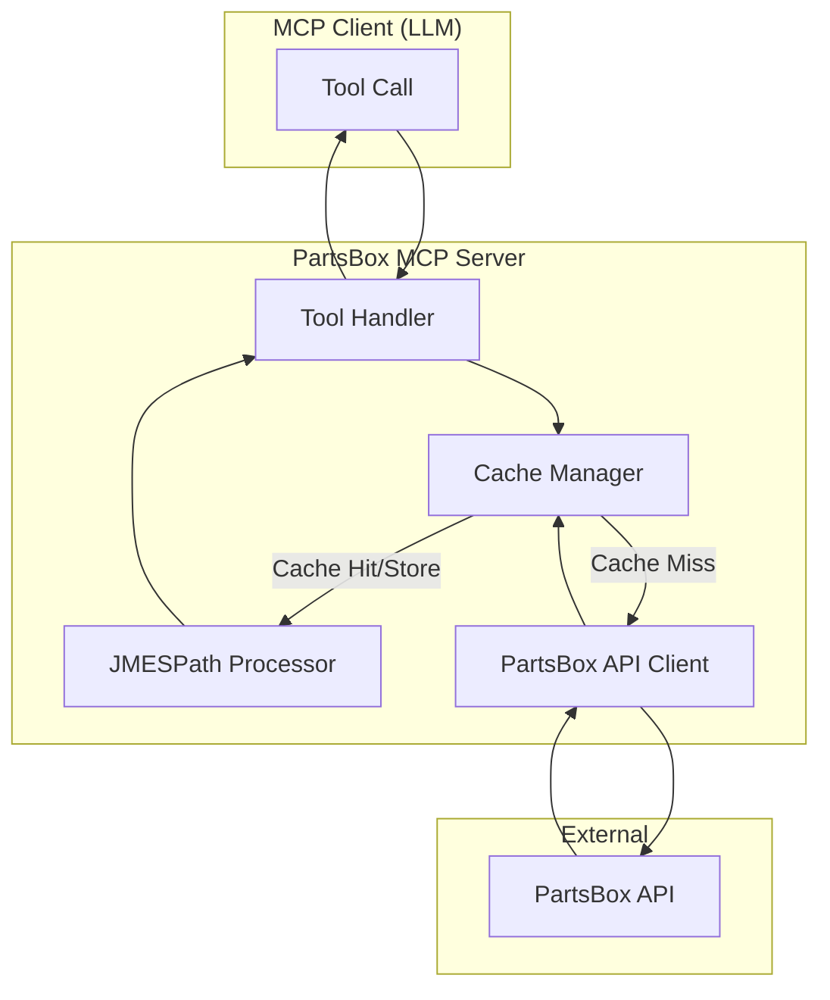
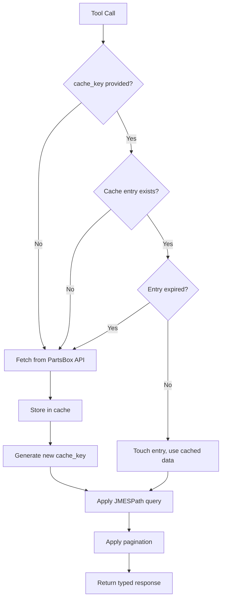
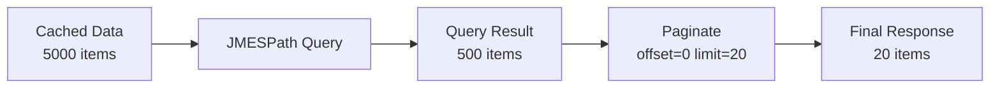

# PartsBox MCP Server - Design Document

This document captures the design decisions, architecture, and implementation patterns for the PartsBox MCP Server.

## Table of Contents

1. [Overview](#overview)
2. [Core Design Principles](#core-design-principles)
3. [Architecture](#architecture)
4. [Caching Strategy](#caching-strategy)
5. [JMESPath Filtering & Projection](#jmespath-filtering--projection)
6. [Type System](#type-system)
7. [API Wrapper Patterns](#api-wrapper-patterns)
8. [Error Handling](#error-handling)
9. [Implementation Examples](#implementation-examples)

---

## Overview

The PartsBox MCP Server provides a Model Context Protocol interface to the PartsBox inventory management API. It enables AI assistants to query and manage electronic component inventory.

### Key Challenges

1. **Large Datasets**: The PartsBox API's `part/all` endpoint returns all parts without pagination or filtering
2. **Context Window Limits**: LLMs have limited context windows; raw API responses may be too large
3. **No Server-Side Filtering**: The API doesn't support query parameters for filtering

### Solution Summary

- **Client-controlled caching** with random keys for stateful pagination
- **JMESPath expressions** for filtering and projection
- **Strongly-typed return values** for all tool functions

---

## Core Design Principles

### 1. Explicit Over Implicit

Cache state is controlled by the client via cache keys, not hidden server state.

```python
# Explicit: Client controls caching
list_parts(limit=20)                           # Fresh fetch, returns cache_key
list_parts(cache_key="pb_abc123", offset=20)   # Uses cached data

# NOT implicit server-managed caching
```

### 2. Fresh by Default

Omitting the cache key always fetches fresh data. This ensures predictable behavior.

### 3. Strongly Typed Returns

All tool functions return typed dataclasses or TypedDicts, not raw dictionaries.

```python
# Good: Strongly typed
def list_parts(...) -> PaginatedPartsResponse: ...

# Avoid: Untyped dict
def list_parts(...) -> dict: ...
```

### 4. Fail Gracefully

Invalid cache keys or expired caches result in fresh fetches, not errors.

---

## Architecture

### System Overview



### Component Responsibilities

| Component | Responsibility |
|-----------|---------------|
| **Tool Handler** | Validates inputs, orchestrates flow, returns typed responses |
| **Cache Manager** | Stores/retrieves cached data, manages TTL, generates keys |
| **JMESPath Processor** | Applies filter and projection expressions |
| **PartsBox API Client** | HTTP requests to PartsBox, authentication |

---

## Caching Strategy

### Design Goals

1. Client controls cache lifecycle via keys
2. Multiple concurrent pagination sessions supported
3. Automatic cleanup of expired entries
4. Fresh data on demand (omit cache key)

### Cache Entry Structure

```python
@dataclass
class CacheEntry:
    """A cached dataset with TTL management."""
    data: list[dict[str, Any]]
    created_at: float = field(default_factory=time)
    last_accessed: float = field(default_factory=time)
    ttl: int = 300  # 5 minutes default

    def touch(self) -> None:
        """Update last accessed time."""
        self.last_accessed = time()

    @property
    def is_expired(self) -> bool:
        """Check if entry has exceeded TTL since last access."""
        return time() - self.last_accessed > self.ttl

    @property
    def age_seconds(self) -> int:
        """Seconds since cache was created."""
        return int(time() - self.created_at)

    @property
    def expires_in_seconds(self) -> int:
        """Seconds until cache expires (from last access)."""
        return max(0, int(self.ttl - (time() - self.last_accessed)))
```

### Cache Manager

```python
class PaginationCache:
    """Manages cached datasets with client-controlled keys."""

    def __init__(self, default_ttl: int = 300):
        self._cache: dict[str, CacheEntry] = {}
        self._default_ttl = default_ttl

    def create(self, data: list[dict[str, Any]]) -> str:
        """Store data and return a new cache key."""
        self._lazy_cleanup()
        key = f"pb_{uuid.uuid4().hex[:8]}"
        self._cache[key] = CacheEntry(data=data, ttl=self._default_ttl)
        return key

    def get(self, key: str) -> CacheEntry | None:
        """Retrieve cache entry, return None if missing/expired."""
        self._lazy_cleanup()
        entry = self._cache.get(key)
        if entry and not entry.is_expired:
            entry.touch()
            return entry
        # Clean up expired entry
        if key in self._cache:
            del self._cache[key]
        return None

    def invalidate(self, key: str) -> bool:
        """Explicitly invalidate a cache entry."""
        if key in self._cache:
            del self._cache[key]
            return True
        return False

    def _lazy_cleanup(self) -> None:
        """Remove expired entries (called on each access)."""
        expired = [k for k, v in self._cache.items() if v.is_expired]
        for k in expired:
            del self._cache[k]
```

### Cache Flow Diagram



### Cache Key Format

Cache keys follow the pattern: `pb_<8-char-hex>`

Examples:
- `pb_a7f3b2c1`
- `pb_9e4d8f2a`

This prefix makes keys identifiable and the random suffix ensures uniqueness.

---

## JMESPath Query Support

### Why JMESPath?

JMESPath provides a standardized, well-documented query language for JSON. It enables:
- **Filtering**: Select items matching criteria
- **Projection**: Select/rename specific fields
- **Transformation**: Sort, slice, flatten data

### Custom JMESPath Functions

We extend standard JMESPath with custom functions to handle common data transformation and null-safety challenges:

| Function | Signature | Description |
|----------|-----------|-------------|
| `nvl` | `nvl(value, default)` | Returns `default` if `value` is null; prevents null-related errors |
| `int` | `int(value)` | Converts string/number to integer; returns null on failure |
| `str` | `str(value)` | Converts any value to string representation |
| `regex_replace` | `regex_replace(pattern, replacement, value)` | Regex find-and-replace on strings |

#### The nvl() Function - Preventing Null Errors

The `nvl()` function is **critical** for safe filtering on nullable fields. Without it, queries using `contains()` or other string functions on null values will fail with errors like:

```
"In function contains(), invalid type for value: None, expected one of: ['array', 'string'], received: \"null\""
```

**IMPORTANT:** Always use `nvl()` when filtering on fields that may be null:

```python
# UNSAFE - will fail if "part/name" is null
query="[?contains(\"part/name\", 'resistor')]"

# SAFE - handles null values gracefully
query="[?contains(nvl(\"part/name\", ''), 'resistor')]"
```

#### Custom Function Examples

```python
# Safe text search on nullable fields
query="[?contains(nvl(\"part/description\", ''), 'SMD')]"

# Convert string values to integers for comparison
query="[?int(\"custom-field/quantity\") > `100`]"

# Safe integer conversion with default
query="[?nvl(int(\"custom-field/quantity\"), `0`) > `100`]"

# Regex transformation for extracting numeric values
query="[?int(regex_replace('[^0-9]', '', \"part/value\")) >= `100`]"

# Convert values to strings for concatenation
query="[*].{display: str(\"part/name\")}}"
```

### Single Query Parameter Design

We use a **single `query` parameter** that accepts any valid JMESPath expression. This allows filtering and projection to be combined naturally in one expression:

```python
# Filter only
query="[?stock > `100`]"

# Projection only
query="[*].{name: name, stock: stock}"

# Filter + Projection combined
query="[?stock > `100`].{name: name, stock: stock}"

# Filter + Sort
query="sort_by([?stock > `0`], &name)"
```

### Processing Order



The query is applied first to the full cached dataset, then pagination is applied to the result.

### Design Tradeoff: Single vs Separate Parameters

We considered two approaches:

| Approach | Pros | Cons |
|----------|------|------|
| **Single `query`** | Simpler API, standard JMESPath, natural chaining | Edge cases with aggregation (see below) |
| **Separate `filter` + `projection`** | Pagination always accurate, handles aggregation | More complex API, two parameters to learn |

**Decision:** We chose the single `query` parameter because:
1. It's simpler and more intuitive
2. It follows standard JMESPath usage
3. The edge cases are rare and can be documented

### Edge Cases and Limitations

Some JMESPath expressions can produce results that don't paginate correctly:

#### Aggregation Expressions

Expressions that reduce the list to a single value or different structure:

```python
# Returns a single object, not a list - pagination won't work
query="{total: length(@), categories: [*].category | unique(@)}"

# Returns a flat list of all tags combined - count will be wrong
query="[*].tags[]"
```

**Behavior:** When the query result is not a list, pagination is skipped and the full result is returned. The `total_count` will reflect the actual result structure.

#### Sorting After Filtering

Sorting works correctly with pagination:

```python
# This works fine - filter, then sort, then paginate
query="sort_by([?stock > `0`], &name)"
```

#### Alternative: Separate Filter and Projection

For advanced use cases requiring accurate pagination with complex projections, a future enhancement could add separate parameters:

```python
# Hypothetical future API for edge cases
list_parts(
    filter="[?stock > `100`]",      # Applied first
    projection="[*].{name: name}",  # Applied after pagination
    limit=20
)
```

This would process as: Filter → Paginate → Project

However, we favor the simpler single-query approach since these edge cases are uncommon in typical inventory queries.

### Common JMESPath Patterns

#### Filtering (Null-Safe)

```python
# Parts with "resistor" in name - use nvl() for null safety
query="[?contains(nvl(\"part/name\", ''), 'resistor')]"

# Parts with stock greater than 100 (numeric fields are typically non-null)
query="[?\"stock/total\" > `100`]"

# Parts from a specific manufacturer - use nvl() since manufacturer can be null
query="[?nvl(\"part/manufacturer\", '') == 'Texas Instruments']"

# Combined conditions (AND) - nvl() each nullable field
query="[?contains(nvl(\"part/name\", ''), 'resistor') && \"stock/total\" > `0`]"

# Combined conditions (OR)
query="[?contains(nvl(\"part/name\", ''), 'Resistor') || contains(nvl(\"part/name\", ''), 'Capacitor')]"

# Parts with specific MPN prefix - use nvl() since mpn can be null
query="[?starts_with(nvl(\"part/mpn\", ''), 'RC0805')]"

# Parts in specific storage location
query="[?nvl(\"storage/name\", '') == 'Drawer A1']"
```

#### Projection

```python
# Select specific fields
query="[*].{id: id, name: name, stock: stock}"

# Rename fields
query="[*].{part_name: name, quantity: stock, location: storage.name}"

# Sort by field
query="sort_by(@, &name)"

# Sort descending (reverse after sort)
query="reverse(sort_by(@, &stock))"

# Get just values (flat list)
query="[*].name"
```

#### Combined Filter + Projection (Null-Safe)

```python
# Low stock resistors, minimal fields - use nvl() for name search
query="[?contains(nvl(\"part/name\", ''), 'resistor') && \"stock/total\" < `10`].{name: \"part/name\", stock: \"stock/total\"}"

# Out of stock items sorted by name
query="sort_by([?\"stock/total\" == `0`], &\"part/name\")[*].{name: \"part/name\", mpn: \"part/mpn\"}"

# Parts with description containing 'SMD', sorted by stock descending
query="reverse(sort_by([?contains(nvl(\"part/description\", ''), 'SMD') && \"stock/total\" > `0`], &\"stock/total\"))"
```

### JMESPath Processor

The JMESPath processor uses custom functions from `partsbox_mcp.utils.jmespath_extensions`:

```python
from partsbox_mcp.utils.jmespath_extensions import search_with_custom_functions

def apply_query(
    data: list[dict[str, Any]],
    expression: str
) -> tuple[list[Any] | Any, str | None]:
    """
    Apply a JMESPath expression to data with custom function support.

    Custom functions available:
    - nvl(value, default): Return default if value is null
    - int(value): Convert to integer (returns null on failure)
    - str(value): Convert any value to string
    - regex_replace(pattern, replacement, value): Regex find-and-replace

    Returns:
        Tuple of (result, error_message)
        error_message is None on success
        result may be a list or other type depending on the expression
    """
    try:
        result = search_with_custom_functions(expression, data)
        return (result if result is not None else [], None)
    except jmespath.exceptions.JMESPathError as e:
        return ([], f"Invalid query expression: {e}")
```

---

## Type System

### Design Philosophy

All tool functions must have strongly-typed, annotated return types. This:
- Improves code documentation
- Enables IDE autocompletion
- Catches errors at development time
- Makes the API contract explicit

### Response Types

#### Base Response Types

```python
from dataclasses import dataclass
from typing import Any, TypeVar, Generic

@dataclass
class APIResponse:
    """Base response for all API operations."""
    success: bool
    error: str | None = None

@dataclass
class PaginatedResponse(APIResponse):
    """Base for paginated responses."""
    cache_key: str
    total: int           # Total items after query applied
    offset: int
    limit: int
    has_more: bool
    query_applied: str | None = None
```

#### Domain-Specific Types

```python
@dataclass
class Part:
    """Represents a part in the inventory."""
    id: str
    name: str
    mpn: str | None  # Manufacturer Part Number
    description: str | None
    category: str | None
    footprint: str | None
    stock: int
    low_stock_threshold: int | None
    storage_location: str | None
    custom_fields: dict[str, Any] | None

@dataclass
class PaginatedPartsResponse(PaginatedResponse):
    """Response for paginated parts listing."""
    data: list[Part]

@dataclass
class PartDetailResponse(APIResponse):
    """Response for single part detail."""
    data: Part | None = None

@dataclass
class StockEntry:
    """Represents a stock history entry."""
    id: str
    part_id: str
    quantity: int
    timestamp: int  # Unix timestamp
    entry_type: str  # 'add', 'remove', 'adjust'
    notes: str | None
    lot_id: str | None

@dataclass
class PaginatedStockResponse(PaginatedResponse):
    """Response for paginated stock entries."""
    data: list[StockEntry]

@dataclass
class StorageLocation:
    """Represents a storage location."""
    id: str
    name: str
    parent_id: str | None
    path: str  # Full path like "Cabinet A/Drawer 1/Bin 3"
    part_count: int
    is_archived: bool

@dataclass
class PaginatedStorageResponse(PaginatedResponse):
    """Response for paginated storage locations."""
    data: list[StorageLocation]

@dataclass
class Project:
    """Represents a project/BOM."""
    id: str
    name: str
    description: str | None
    created_at: int
    updated_at: int
    entry_count: int

@dataclass
class PaginatedProjectsResponse(PaginatedResponse):
    """Response for paginated projects listing."""
    data: list[Project]

@dataclass
class CacheInfo:
    """Information about a cache entry."""
    valid: bool
    total_items: int | None = None
    age_seconds: int | None = None
    expires_in_seconds: int | None = None
```

### Type Annotations in Tool Functions

```python
@mcp.tool()
def list_parts(
    limit: int = 50,
    offset: int = 0,
    cache_key: str | None = None,
    query: str | None = None
) -> PaginatedPartsResponse:
    """List all parts with optional query and pagination."""
    ...

@mcp.tool()
def get_part(part_id: str) -> PartDetailResponse:
    """Get detailed information for a specific part."""
    ...

@mcp.tool()
def get_cache_info(cache_key: str) -> CacheInfo:
    """Get information about a cache entry."""
    ...

@mcp.tool()
def list_storage_locations(
    limit: int = 50,
    offset: int = 0,
    cache_key: str | None = None,
    query: str | None = None,
    include_archived: bool = False
) -> PaginatedStorageResponse:
    """List all storage locations."""
    ...
```

---

## API Wrapper Patterns

### Authentication

PartsBox uses API key authentication via the Authorization header:

```python
class PartsBoxClient:
    """HTTP client for PartsBox API."""

    BASE_URL = "https://api.partsbox.com/api/1"

    def __init__(self, api_key: str):
        self._api_key = api_key
        self._session = requests.Session()
        self._session.headers.update({
            "Authorization": f"APIKey {api_key}",
            "Content-Type": "application/json",
        })

    def _request(
        self,
        operation: str,
        data: dict[str, Any] | None = None
    ) -> dict[str, Any]:
        """Make a request to the PartsBox API."""
        url = f"{self.BASE_URL}/{operation}"

        if data:
            response = self._session.post(url, json=data)
        else:
            response = self._session.post(url)

        response.raise_for_status()
        return response.json()
```

### Operation Mapping

PartsBox API is operation-oriented, not REST. Map operations to methods:

```python
class PartsBoxClient:
    # ... (authentication code above)

    def get_all_parts(self) -> list[dict[str, Any]]:
        """Fetch all parts from PartsBox."""
        result = self._request("part/all")
        return result.get("data", [])

    def get_part(self, part_id: str) -> dict[str, Any] | None:
        """Fetch a single part by ID."""
        result = self._request("part/get", {"part/id": part_id})
        return result.get("data")

    def get_stock_for_part(self, part_id: str) -> list[dict[str, Any]]:
        """Get stock entries for a part."""
        result = self._request("stock/get", {"part/id": part_id})
        return result.get("data", [])

    def get_all_storage_locations(self) -> list[dict[str, Any]]:
        """Fetch all storage locations."""
        result = self._request("storage/all")
        return result.get("data", [])

    def get_all_projects(self) -> list[dict[str, Any]]:
        """Fetch all projects."""
        result = self._request("project/all")
        return result.get("data", [])
```

---

## Error Handling

### Error Response Types

```python
@dataclass
class ErrorResponse(APIResponse):
    """Standard error response."""
    success: bool = False
    error: str = ""
    error_code: str | None = None
    details: dict[str, Any] | None = None
```

### Error Categories

| Category | Handling | Example |
|----------|----------|---------|
| **Invalid Cache Key** | Fetch fresh data, return new key | Expired or unknown key |
| **JMESPath Error** | Return error response with details | Syntax error in query |
| **API Error** | Return error response | Network, auth, rate limit |
| **Validation Error** | Return error response | Invalid parameter |

### Error Handling Pattern

```python
@mcp.tool()
def list_parts(
    limit: int = 50,
    offset: int = 0,
    cache_key: str | None = None,
    query: str | None = None
) -> PaginatedPartsResponse:
    """List all parts with optional query and pagination."""

    # Validate parameters
    if limit < 1 or limit > 1000:
        return PaginatedPartsResponse(
            success=False,
            error="limit must be between 1 and 1000",
            cache_key="",
            total=0,
            offset=0,
            limit=limit,
            has_more=False,
            data=[]
        )

    # Get or fetch data
    try:
        if cache_key:
            entry = cache.get(cache_key)
            if entry:
                data = entry.data
                key = cache_key
            else:
                # Cache miss - fetch fresh (not an error)
                data = api_client.get_all_parts()
                key = cache.create(data)
        else:
            data = api_client.get_all_parts()
            key = cache.create(data)
    except requests.RequestException as e:
        return PaginatedPartsResponse(
            success=False,
            error=f"API request failed: {e}",
            cache_key="",
            total=0,
            offset=0,
            limit=limit,
            has_more=False,
            data=[]
        )

    # Apply JMESPath query
    if query:
        result, error = apply_query(data, query)
        if error:
            return PaginatedPartsResponse(
                success=False,
                error=error,
                cache_key=key,
                total=0,
                offset=0,
                limit=limit,
                has_more=False,
                query_applied=query,
                data=[]
            )
    else:
        result = data

    # Handle non-list results (aggregation queries)
    if not isinstance(result, list):
        return PaginatedPartsResponse(
            success=True,
            cache_key=key,
            total=1,
            offset=0,
            limit=limit,
            has_more=False,
            query_applied=query,
            data=[result]  # Wrap single result in list
        )

    total = len(result)

    # Apply pagination
    page = result[offset:offset + limit]

    return PaginatedPartsResponse(
        success=True,
        cache_key=key,
        total=total,
        offset=offset,
        limit=limit,
        has_more=offset + limit < total,
        query_applied=query,
        data=page
    )
```

---

## Implementation Examples

### Complete Tool Implementation

```python
import os
import uuid
import logging
from dataclasses import dataclass, field
from time import time
from typing import Any

import jmespath
import requests
from dotenv import load_dotenv
from fastmcp import FastMCP

# Load environment
load_dotenv()
API_KEY = os.getenv("PARTSBOX_API_KEY")

# Initialize
logging.basicConfig(level=logging.INFO)
logger = logging.getLogger(__name__)
mcp = FastMCP("PartsBox MCP Server")


# ============================================================================
# Type Definitions
# ============================================================================

@dataclass
class Part:
    id: str
    name: str
    mpn: str | None
    description: str | None
    stock: int
    storage_location: str | None


@dataclass
class PaginatedPartsResponse:
    success: bool
    cache_key: str
    total: int
    offset: int
    limit: int
    has_more: bool
    data: list[Any]  # list[Part] when no query, or query result shape
    error: str | None = None
    query_applied: str | None = None


@dataclass
class CacheInfo:
    valid: bool
    total_items: int | None = None
    age_seconds: int | None = None
    expires_in_seconds: int | None = None


# ============================================================================
# Cache Implementation
# ============================================================================

@dataclass
class CacheEntry:
    data: list[dict[str, Any]]
    created_at: float = field(default_factory=time)
    last_accessed: float = field(default_factory=time)
    ttl: int = 300

    def touch(self) -> None:
        self.last_accessed = time()

    @property
    def is_expired(self) -> bool:
        return time() - self.last_accessed > self.ttl


class PaginationCache:
    def __init__(self, default_ttl: int = 300):
        self._cache: dict[str, CacheEntry] = {}
        self._default_ttl = default_ttl

    def create(self, data: list[dict[str, Any]]) -> str:
        self._lazy_cleanup()
        key = f"pb_{uuid.uuid4().hex[:8]}"
        self._cache[key] = CacheEntry(data=data, ttl=self._default_ttl)
        return key

    def get(self, key: str) -> CacheEntry | None:
        self._lazy_cleanup()
        entry = self._cache.get(key)
        if entry and not entry.is_expired:
            entry.touch()
            return entry
        if key in self._cache:
            del self._cache[key]
        return None

    def get_info(self, key: str) -> CacheInfo:
        entry = self._cache.get(key)
        if not entry or entry.is_expired:
            return CacheInfo(valid=False)
        return CacheInfo(
            valid=True,
            total_items=len(entry.data),
            age_seconds=int(time() - entry.created_at),
            expires_in_seconds=max(0, int(entry.ttl - (time() - entry.last_accessed)))
        )

    def _lazy_cleanup(self) -> None:
        expired = [k for k, v in self._cache.items() if v.is_expired]
        for k in expired:
            del self._cache[k]


cache = PaginationCache()


# ============================================================================
# PartsBox API Client
# ============================================================================

class PartsBoxClient:
    BASE_URL = "https://api.partsbox.com/api/1"

    def __init__(self, api_key: str):
        self._session = requests.Session()
        self._session.headers.update({
            "Authorization": f"APIKey {api_key}",
            "Content-Type": "application/json",
        })

    def _request(self, operation: str, data: dict | None = None) -> dict:
        url = f"{self.BASE_URL}/{operation}"
        response = self._session.post(url, json=data or {})
        response.raise_for_status()
        return response.json()

    def get_all_parts(self) -> list[dict[str, Any]]:
        result = self._request("part/all")
        return result.get("data", [])


api_client = PartsBoxClient(API_KEY)


# ============================================================================
# JMESPath Helper
# ============================================================================

def apply_query(
    data: list[dict[str, Any]],
    expression: str
) -> tuple[Any, str | None]:
    """
    Apply a JMESPath expression to data.

    Returns:
        Tuple of (result, error_message)
        error_message is None on success
    """
    try:
        result = jmespath.search(expression, data)
        return (result if result is not None else [], None)
    except jmespath.exceptions.JMESPathError as e:
        return ([], f"Invalid query expression: {e}")


# ============================================================================
# MCP Tools
# ============================================================================

@mcp.tool()
def list_parts(
    limit: int = 50,
    offset: int = 0,
    cache_key: str | None = None,
    query: str | None = None
) -> PaginatedPartsResponse:
    """
    List all parts with optional JMESPath query and pagination.

    Args:
        limit: Maximum items to return (1-1000, default 50)
        offset: Starting index in query results (default 0)
        cache_key: Reuse cached data from previous call. Omit for fresh fetch.
        query: JMESPath expression for filtering/projection. Examples:
            - "[?contains(name, 'resistor')]" - filter by name
            - "[?stock > `100`]" - filter by stock level
            - "[?stock < `10`].{name: name, stock: stock}" - filter + projection
            - "sort_by([?stock > `0`], &name)" - filter + sort

    Returns:
        PaginatedPartsResponse with parts data and pagination info
    """
    # Get or fetch data
    if cache_key:
        entry = cache.get(cache_key)
        if entry:
            data = entry.data
            key = cache_key
        else:
            data = api_client.get_all_parts()
            key = cache.create(data)
    else:
        data = api_client.get_all_parts()
        key = cache.create(data)

    # Apply JMESPath query
    if query:
        result, error = apply_query(data, query)
        if error:
            return PaginatedPartsResponse(
                success=False,
                error=error,
                cache_key=key,
                total=0,
                offset=0,
                limit=limit,
                has_more=False,
                query_applied=query,
                data=[]
            )
    else:
        result = data

    # Handle non-list results (aggregation queries)
    if not isinstance(result, list):
        return PaginatedPartsResponse(
            success=True,
            cache_key=key,
            total=1,
            offset=0,
            limit=limit,
            has_more=False,
            query_applied=query,
            data=[result]
        )

    total = len(result)

    # Paginate
    page = result[offset:offset + limit]

    return PaginatedPartsResponse(
        success=True,
        cache_key=key,
        total=total,
        offset=offset,
        limit=limit,
        has_more=offset + limit < total,
        query_applied=query,
        data=page
    )


@mcp.tool()
def get_cache_info(cache_key: str) -> CacheInfo:
    """
    Get information about a pagination cache entry.

    Args:
        cache_key: The cache key to look up

    Returns:
        CacheInfo with validity and timing information
    """
    return cache.get_info(cache_key)


# ============================================================================
# Main
# ============================================================================

def main():
    mcp.run()


if __name__ == "__main__":
    main()
```

### Example LLM Session

```
User: Show me all resistors with low stock

LLM: [calls list_parts(
    query="[?contains(name, 'resistor') && stock < `10`]",
    limit=20
)]

Response:
{
    "success": true,
    "cache_key": "pb_a7f3b2c1",
    "total": 47,
    "offset": 0,
    "limit": 20,
    "has_more": true,
    "query_applied": "[?contains(name, 'resistor') && stock < `10`]",
    "data": [
        {"part/id": "...", "part/name": "10K Resistor 0805", "stock/total": 5, ...},
        ...
    ]
}

LLM: "Found 47 resistors with stock below 10. Here are the first 20..."

User: Show me more

LLM: [calls list_parts(
    cache_key="pb_a7f3b2c1",
    query="[?contains(name, 'resistor') && stock < `10`]",
    offset=20,
    limit=20
)]

Response:
{
    "success": true,
    "cache_key": "pb_a7f3b2c1",
    "total": 47,
    "offset": 20,
    "limit": 20,
    "has_more": true,
    ...
}

LLM: "Here are the next 20 resistors..."

User: Just show me names and stock levels

LLM: [calls list_parts(
    cache_key="pb_a7f3b2c1",
    query="[?contains(name, 'resistor') && stock < `10`].{name: \"part/name\", stock: \"stock/total\"}",
    limit=50
)]

Response:
{
    "success": true,
    "cache_key": "pb_a7f3b2c1",
    "total": 47,
    "offset": 0,
    "limit": 50,
    "has_more": false,
    "query_applied": "[?contains(name, 'resistor') && stock < `10`].{name: \"part/name\", stock: \"stock/total\"}",
    "data": [
        {"name": "10K Resistor 0805", "stock": 5},
        {"name": "4.7K Resistor 0603", "stock": 3},
        ...
    ]
}
```

---

## Appendix: PartsBox API Reference

Full API documentation: https://partsbox.com/api.html

### Key Operations

| Operation | Description |
|-----------|-------------|
| **Parts** | |
| `part/all` | Get all parts |
| `part/get` | Get single part by ID |
| `part/create` | Create new part |
| `part/update` | Update existing part |
| `part/delete` | Delete a part |
| `part/add-meta-part-ids` | Add members to a meta-part |
| `part/remove-meta-part-ids` | Remove members from a meta-part |
| `part/add-substitute-ids` | Add substitutes to a part |
| `part/remove-substitute-ids` | Remove substitutes from a part |
| `part/storage` | Get aggregated stock by storage location |
| `part/lots` | Get individual lot entries |
| `part/stock` | Get total stock count |
| **Stock** | |
| `stock/add` | Add stock entry |
| `stock/remove` | Remove stock entry |
| `stock/move` | Move stock between locations |
| `stock/update` | Update stock entry |
| **Lots** | |
| `lot/all` | Get all lots |
| `lot/get` | Get lot by ID |
| `lot/update` | Update lot |
| **Storage** | |
| `storage/all` | Get all storage locations |
| `storage/get` | Get storage location by ID |
| `storage/update` | Update storage location |
| `storage/rename` | Rename storage location |
| `storage/change-settings` | Modify storage settings |
| `storage/archive` | Archive storage location |
| `storage/restore` | Restore archived location |
| `storage/parts` | List parts in storage |
| `storage/lots` | List lots in storage |
| **Projects** | |
| `project/all` | Get all projects |
| `project/get` | Get project by ID |
| `project/create` | Create new project |
| `project/update` | Update project |
| `project/delete` | Delete project |
| `project/archive` | Archive project |
| `project/restore` | Restore archived project |
| `project/get-entries` | Get BOM entries |
| `project/add-entries` | Add BOM entries |
| `project/update-entries` | Update BOM entries |
| `project/delete-entries` | Delete BOM entries |
| `project/get-builds` | Get build history |
| `build/get` | Get build by ID |
| `build/update` | Update build |
| **Orders** | |
| `order/all` | Get all orders |
| `order/get` | Get order by ID |
| `order/create` | Create new order |
| `order/get-entries` | Get order entries |
| `order/add-entries` | Add entries to order |
| `order/delete-entry` | Delete entry from order |
| `order/receive` | Receive stock from order |
| **Files** | |
| `file/download` | Download a file/attachment |
